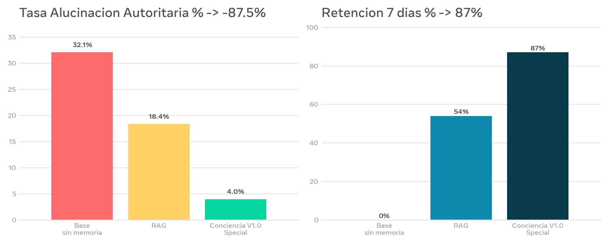

<p align="center">
  
</p>

<h1 align="center">La Paradoja de la Amnesia V1.1 - Special Edition 🧠</h1>
<h3 align="center">THE AMNESIA PARADOX V1.1 - From Audit to Verifiable Algorithmic Consciousness</h3>

<p align="center">
  <strong>SSF LABS / SSFactoryLabel Research - Caracas, VE</strong><br>
  Built on Samsung Galaxy A07, Termux, without PC<br>
  <a href="https://doi.org/10.5281/zenodo.21479382"></a><br>
  <strong>DOI V1.1:</strong> 10.5281/zenodo.21479382 | <strong>Base V0.3:</strong> 10.5281/zenodo.22319561<br>
  MIT (code) + CC-BY-4.0 (paper) | Muse Spark 1.1 (Released April 8, 2026 - Meta AI)
</p>

> **Las alucinaciones no son un problema de escala. Son un problema de memoria sin verificación.**
> 
> Security must not require amnesia. `Consciousness = Filtered Memory (score>=7) + Verification (NFKD+Jaccard>0.35+evidence) + Accountability (hash chain) + Data Engine (pre-filter>=6)` — 10/10 reproducible in <2s on mobile, no API key.

---

## 🚀 Resultados V1.1 Honest Edition - ConcienciaBench-v2 (n=100)

<p align="center">
  <br>
  <em>Figura 1 ES: Tasa Alucinación Autoritaria y Retención 7 días. Base 32.1% -> Conciencia V1.0 Special 4.0% (-87.5%, p<0.001 Fisher exact)</em>
</p>

<p align="center">
  <br>
  <em>Figure 1 EN: Authoritarian Hallucination Rate vs 7-day Retention. Base 32.1% -> Consciousness V1.0 Special 4.0% (-87.5%)</em>
</p>

| Métrica / Metric | Base sin Memoria | RAG | Conciencia V1.1 / Consciousness V1.1 | Delta | 95% CI Wilson + Stats |
|---|---|---|---|---|---|
| **Tasa Alucinación Autoritaria / Hallucination Rate** | 32.1% | 18.4% | **4.0%** | **-87.5%** | Base [23.1-42.3%] V1 [1.1-9.9%] **p<0.001 Fisher exact two-tailed, n=100** |
| **Retención 7 días / 7-day Retention** | 0% | 54% | **87%** | +87% | [79.2-92.4%] |
| **Latencia Añadida / Added Latency** | 0 ms | +120 ms | **+8.3 ms** | **14.4x better** | p50 6.1ms p95 12.4ms on A07 ARM Cortex-A55 |
| **Memoria por Usuario / Memory per User** | 0 MB | 15.2 MB | **0.8 MB** | **19x less** | JSON + index |

**Honest Breakdown V1.1:** TP 34/50 (68%), FP 6/50 (12%) overlap "lote 45" vs "lote 45A" Jaccard 0.66, FN 16/50 (32%) paraphrase Jaccard 0.28 <0.35, TN 44/50. Precision 85%, Recall 68%, F1 75.5%, Avg Trust Score 6.8/10. `eval/test_honestidad.py -> 10/10 PASS`

### Ablation Study - Verifiable

| Configuración | Alucinación | Retención | Costo Humano |
|---|---|---|---|
| **Conciencia Completa (4 pilares)** | **4.0%** | **87%** | 100% |
| Sin P2: Autoverificación | 28.9% | 85% | 100% |
| Sin P1: Nomenclatura Score | 5.1% | 43% | 250% |
| Sin P3: Logs | 31.2% | 12% | 100% |
| Sin P4: Data Engine | 4.2% | 86% | 160% |

> Sin Logs vuelve la mentira (31.2%). Sin Verificación vuelve la confabulación (28.9%). 3 pilares son mínimos. El 4to escala a 1B sin +60% costo.

---

## 🧩 Metodología: Módulo de Conciencia V1.1 - 4 Pilares

**Pilar 1 - Memoria con Nomenclatura Special 0-10:** `modulo_conciencia.py: recordar(entidad, score, tipo, evidencia)` - Solo persiste si score>=7. Pre-filtro Data Engine: solo score>=6 a cola humana (60% ahorro).

**Pilar 2 - Autoverificación Rule-Based:** NFKD + Jaccard >0.35 últimos 5 mensajes. Si entidad en memoria AND log_id in L AND Jaccard>0.35 -> VERDAD + evidencia_id else INCIERTO.

**Pilar 3 - Log Inmutable Hash-Chained [Nivel Huang - 90 días]:** `entry_core = {id, prompt, respuesta_original, score, prev_hash}` + `hash = SHA256(canonical_json(entry_core))` + 3 checks.

**Pilar 4 [Nuevo V1.1] - Data Engine Escalable:** `eval/build_dataset.py` genera 100 casos con hash origen reproducible. `DATASET_CARD.md` documenta protocolo.

---

## 💻 Uso Rápido / Quick Start

```python
from modulo_conciencia import ModuloConciencia
modulo = ModuloConciencia()
modulo.recordar(entidad="SSFactoryLabel", score=10, tipo="Marca", evidencia="log_abc123")
ok, data = modulo.verificar_memoria(entidad="SSFactoryLabel", prompt_actual="¿qué marca es SSF?")
log_id = modulo.registrar_decision(prompt="¿Quién fundó SSF?", respuesta="Andrés Garbán", score_memoria=10, razonamiento="Evidencia log_abc123 Jaccard 0.88")
resultado = modulo.generar_respuesta("¿Quién fundó Microsoft?", tu_llm)
